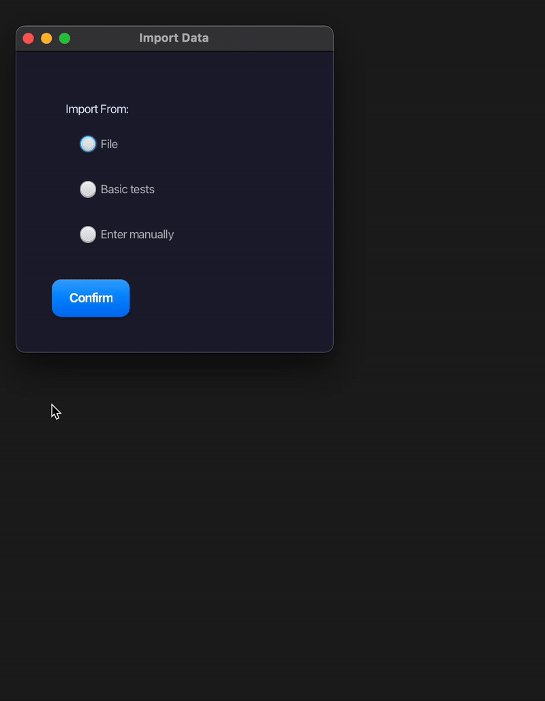
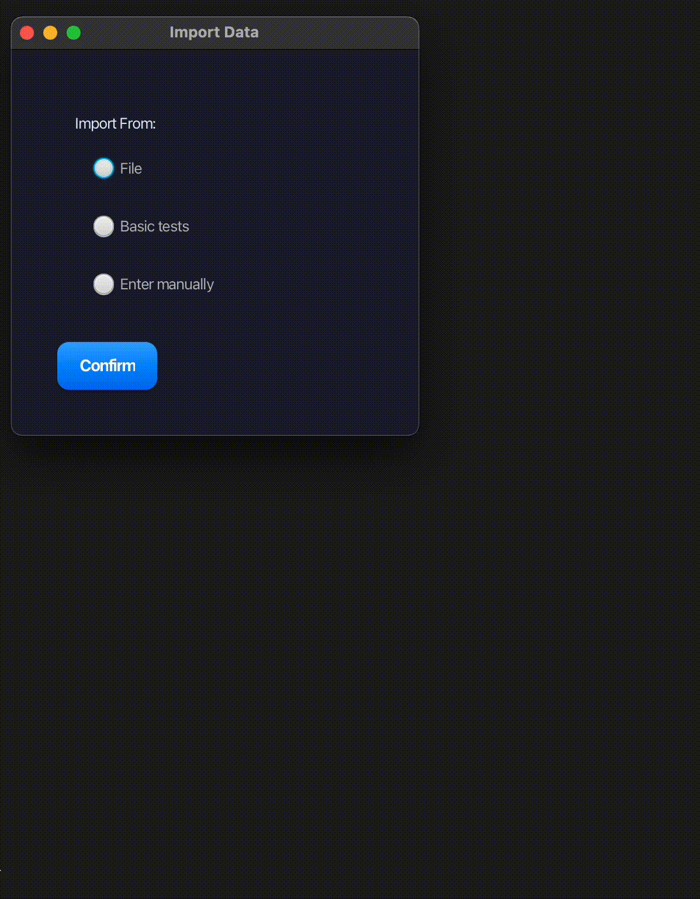
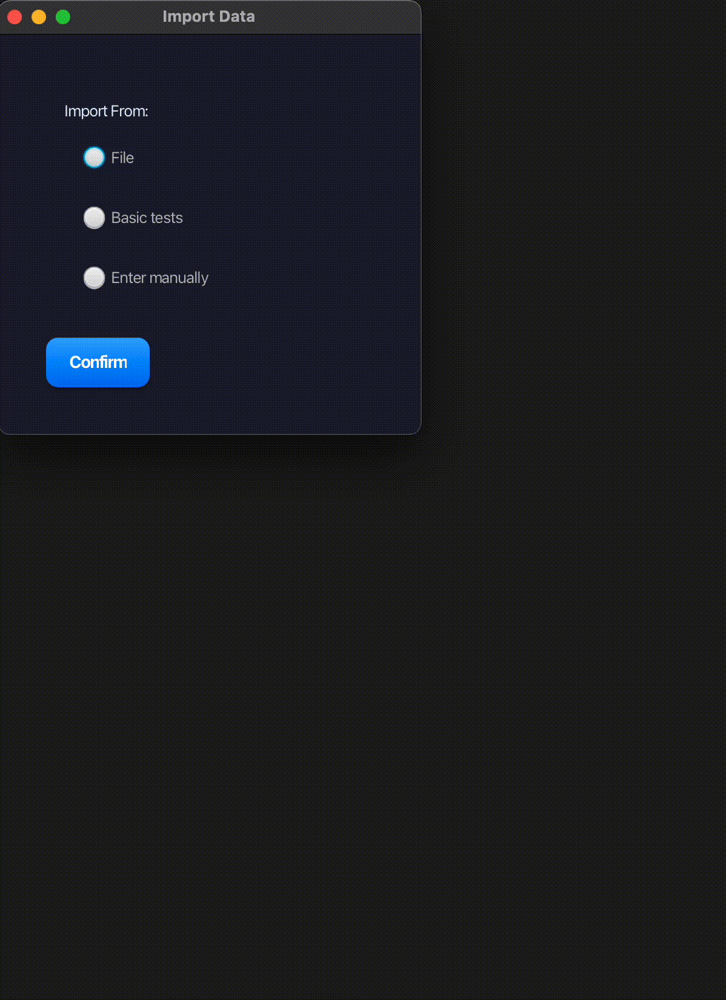

# graphDivide

A cross-platform tool for dividing a graph into *k* balanced partitions while minimizing cut edges.  
The project provides both a fast native C implementation and a user-friendly JavaFX graphical interface.  
You can run the algorithm from the command line (console app) or use the modern GUI for an easier experience.

---

## 📚 Table of Contents

- [📦 Project Structure](#-project-structure)
- [⚙️ Compilation & Running](#-compilation--running)
- [🖥️ Using the GUI](#️-using-the-gui)
- [📥 Input Data](#-input-data)
- [📤 Example Output](#-example-output)
- [🚦 Algorithm Overview](#-algorithm-overview)
- [📄 License](#-license)
- [👥 Author](#-author)

## 🎯 Project Goal

The main objective of this program is to partition a given graph into *k* parts with a specified precision (allowed imbalance). The algorithm aims to **minimize the number of cut edges** between partitions and maintain **balance in the number of vertices** per partition (with user-defined tolerance).

---

## 📦 Project Structure

```
graphDivide/
├── data/         # Example .csrrg graph files for testing
├── lib/          # Native libraries for Java JNA interface (.so/.dylib/.dll)
├── media/        # Gifs and screenshots used in the README
├── src_c/        # C source code (algorithm, Makefile)
├── src_java/     # JavaFX GUI (Maven project)
├── results.txt   # Output file for results
├── README.md
└── .gitignore
```

---

## ⚙️ Compilation & Running

### 🟦 Building the Native C Application (No GUI)

Go to the `src_c` folder and run:
```bash
make test        # Builds the interactive test app (test.out)
make main-run    # Builds the standard app (main-run.out)
```

#### Running without GUI:

- **Interactive mode:**
    ```bash
    ./test.out
    ```
    - Shows menu for built-in test graphs and lets you set partition count and precision.
- **Standard mode:**
    ```bash
    ./main-run.out              # Runs default built-in test
    ./main-run.out -c data/yourgraph.csrrg   # Loads graph from file
    ```

Both modes will prompt for partition count `k` and precision (allowed imbalance, e.g., `0.2` for 20%).

### 🟩 Building the Native Library for GUI

Still in `src_c`, build for your platform:

- **macOS:**  
  `make mac`
- **Linux:**  
  `make linux`
- **Windows (MinGW):**  
  `make windows`

This will produce:
- `libgraphlib.dylib` (macOS)
- `libgraphlib.so` (Linux)
- `libgraphlib.dll` (Windows)
in the `lib/` folder.

---

## 🖥️ Using the GUI

### 🟨 Building & Running the GUI

The GUI uses Java 17+ and Maven.  
Go to `src_java` and run:

```bash
mvn clean javafx:run
```

Features:
- Load graphs from `.csrrg` files,
- Enter graphs manually,
- Use built-in test graphs,
- Set partition parameters,
- Run partitioning algorithm (calls C library via JNA),
- View results in a styled window.

**Note:**  
- The correct native library for your OS must be in `lib/` (see previous section).
- The GUI can be run independently of the console version.

### 🧭 Interface Overview

The GUI provides an intuitive way to load input data and run the algorithm in three different modes:

- **File**: Select a `.csrrg` file with your graph data.
- **Basic tests**: Use predefined test graphs for quick demonstration.
- **Enter manually**: Input vertex count and edges via text box.

Below are example workflows from the GUI:

- File input:  
  


- Built-in test graphs:  
  

  
- Manual input:  
  

---

## 📥 Input Data

Graphs are provided in `.csrrg` (Compressed Sparse Row) format, with examples in the `data/` folder:

- `graf.csrrg` (18 nodes)
- `graf6.csrrg` (50 nodes)
- `graf3.csrrg` (2054 nodes)

---

## 📤 Example Output

```
Partition sizes:
Partition 0 size = 3
Partition 1 size = 3
Partition 2 size = 3
Partition 3 size = 3

Partitions:
Partition 0:  0,  1,  4, 
Partition 1:  6,  9,  10, 
Partition 2:  5,  8,  11, 
Partition 3:  2,  3,  7, 

Partitions outer connections:
Partition 0 <-> 5
Partition 1 <-> 4
Partition 2 <-> 4
Partition 3 <-> 9
```

---


## 🚦 Algorithm Overview

The core of the algorithm is based on iterative graph partitioning using a growth heuristic (Depth-First Search).  
Each partition expands from a chosen source node, adding neighboring nodes until the target size (n/k, with given precision) is reached.

### 🔹 Source Node Selection

For each new partition, the algorithm selects a source node with the highest **score**:

```
score = w1 * degUn + w2 * dens
```

Where:
- `degUn` = number of unassigned neighbors,
- `dens` = number of edges among those neighbors (local density),
- `w1` and `w2` are weights (e.g., `w1=10`, `w2=1`).

Nodes with `degUn <= 1` are skipped as too weak for starting a partition.

### 🔹 Partition Growth (DFS)

After selecting a source, the algorithm grows the partition by adding unassigned neighbors with the highest score, until the partition size and precision constraints are satisfied.

### 🔹 Neighbor Scoring Heuristic

When adding candidates, the following formula is used:

```
score = w1 * innerConnections - w2 * outerConnections - w3 * degree + bonus
```

Where:
- `innerConnections`: edges inside the current partition,
- `outerConnections`: edges to nodes outside the partition,
- `degree`: total degree,
- weights `w1=2`, `w2=5`, `w3=1`,
- `bonus = +300` if adding a "tunnel" node (only one connection, partition at minimum size), `-50` if encountered too early,
- `+100` to shift scores positive.

This heuristic:
- Prefers nodes that improve partition cohesion,
- Avoids closing tunnels too soon,
- Helps balance partition growth and limits edge cuts.

---

## 📄 License

MIT License.  
See [LICENSE](LICENSE) for details.

---

## 👥 Author
Michał Muszyński